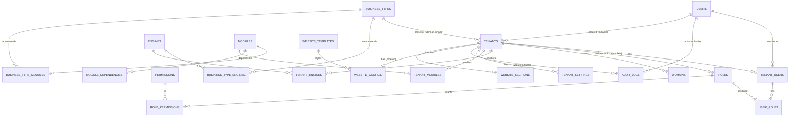
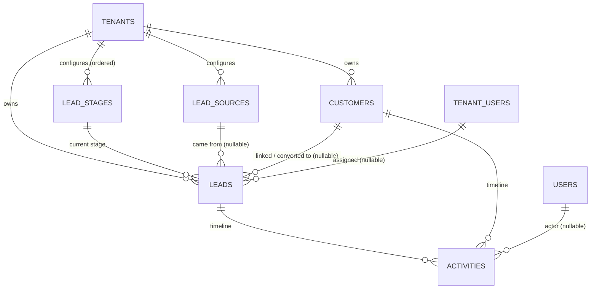
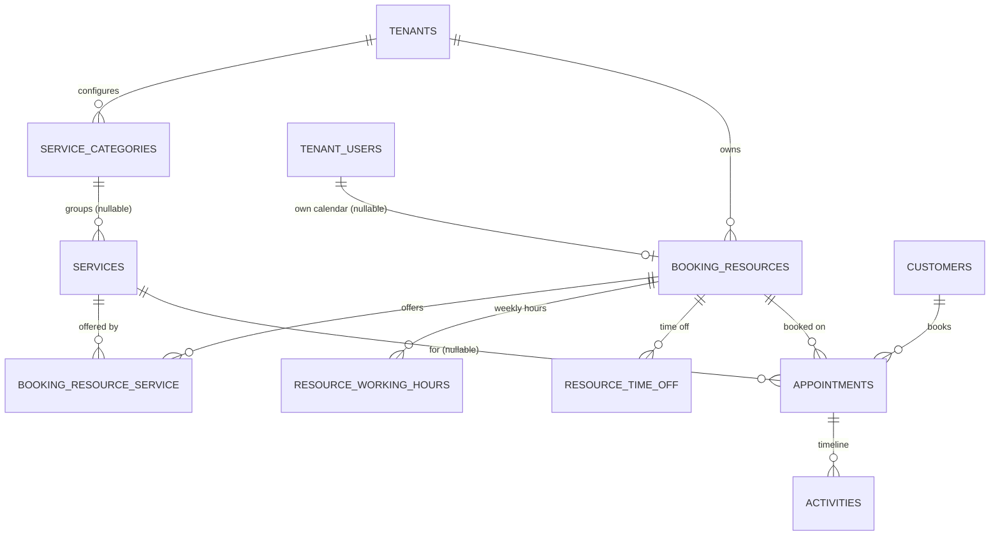
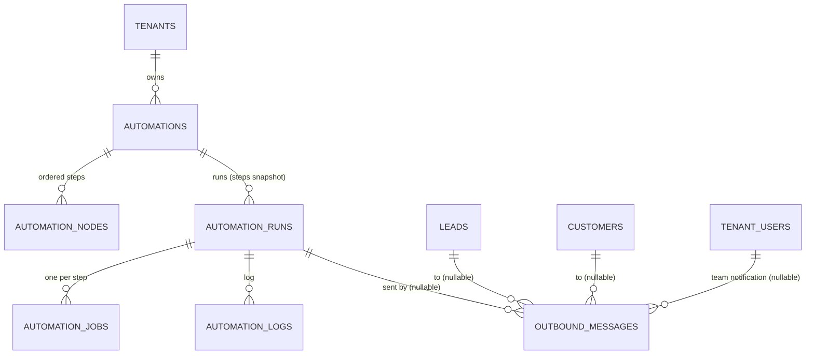

# Entity Relationship Diagram

## Platform core (Phases 1–2 — implemented)

Column details: [schema.md](schema.md).

Phase 2 added `tenants.created_by_user_id` and the website tables (ADR-012).

`USER_ROLES` carries `tenant_id` and composite FKs to both `TENANT_USERS (id, tenant_id)` and
`ROLES (id, tenant_id)`, so a membership and its roles always share a tenant (ADR-011).

Laravel default tables (`sessions`, `password_reset_tokens`, cache, jobs) are omitted.

## CRM (Phase 3 — implemented, ADR-013)

Every arrow between tenant-owned tables is a composite FK `(x_id, tenant_id) → x(id, tenant_id)`. An
activity can belong to a lead, a customer or both (converted leads' history is copied onto the customer).

## Services and booking (Phase 4 — implemented, ADR-014)

All arrows are composite FKs. An appointment's activities also carry its `customer_id`, so they show on the
customer timeline.

## Automation and outbound messages (Phase 5 — implemented, ADR-015)

A run's subject (`subject_type`, `subject_id`) is polymorphic: a lead, customer or appointment. It has no
FK, so deleting the subject does not delete the run's history; the run is cancelled at its next step.
Other arrows are composite FKs.
