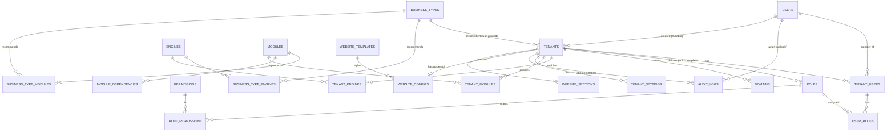
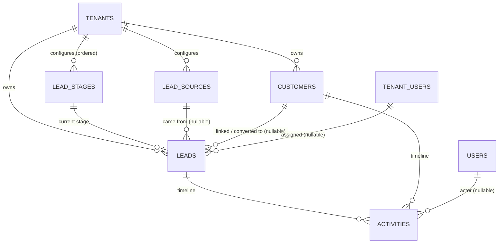
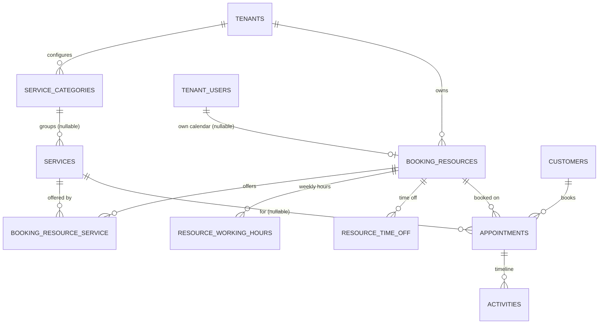
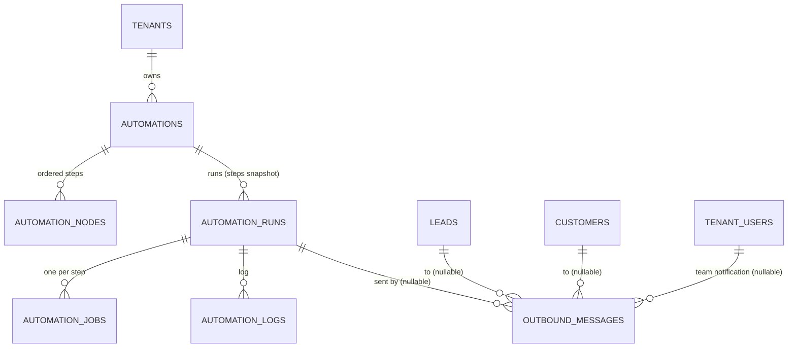
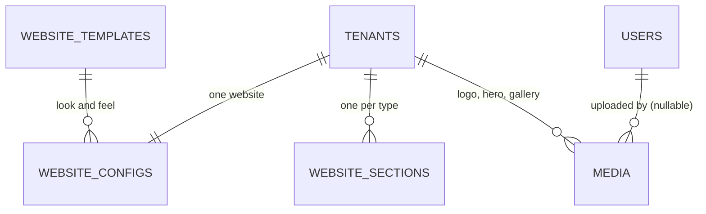
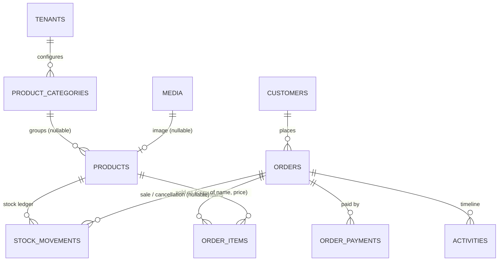
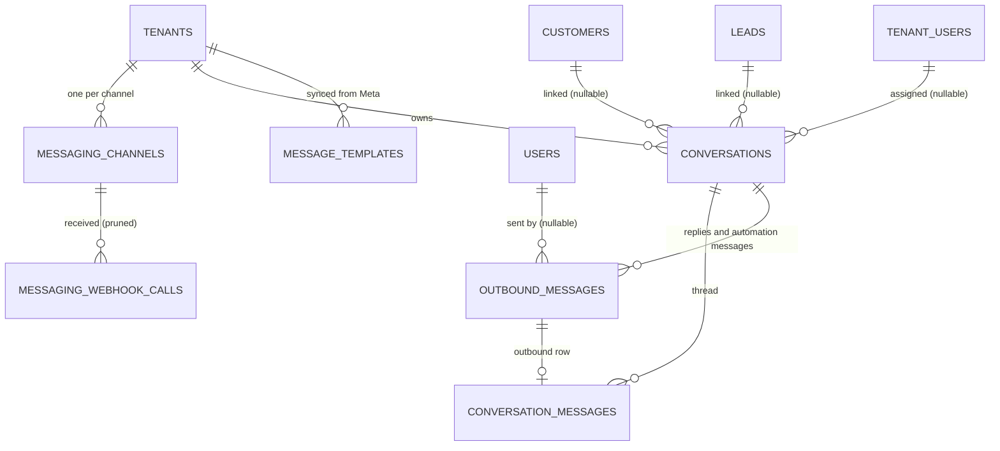
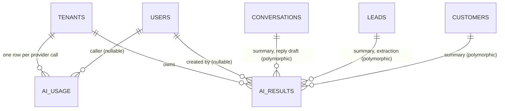
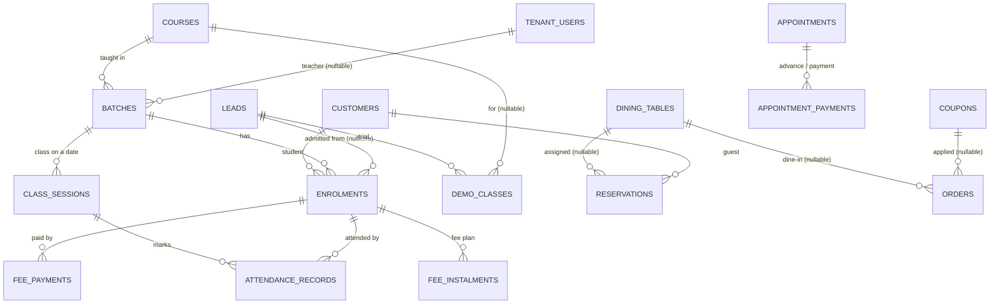

# Entity Relationship Diagram

## Platform core (Phases 1–2 — implemented)

Column details: [schema.md](schema.md).

Phase 2 added `tenants.created_by_user_id` and the website tables (ADR-012).

`USER_ROLES` carries `tenant_id` and composite FKs to both `TENANT_USERS (id, tenant_id)` and
`ROLES (id, tenant_id)`, so a membership and its roles always share a tenant (ADR-011).

Laravel default tables (`sessions`, `password_reset_tokens`, cache, jobs) are omitted.

## CRM (Phase 3 — implemented, ADR-013)

Every arrow between tenant-owned tables is a composite FK `(x_id, tenant_id) → x(id, tenant_id)`. An
activity can belong to a lead, a customer or both (converted leads' history is copied onto the customer).

## Services and booking (Phase 4 — implemented, ADR-014)

All arrows are composite FKs. An appointment's activities also carry its `customer_id`, so they show on the
customer timeline.

## Automation and outbound messages (Phase 5 — implemented, ADR-015)

A run's subject (`subject_type`, `subject_id`) is polymorphic: a lead, customer, appointment or order
(Phase 7). It has no
FK, so deleting the subject does not delete the run's history; the run is cancelled at its next step.
Other arrows are composite FKs.

## Website builder and media (Phase 6 — implemented, ADR-016)

Sections don't reference business records. The public page reads services, booking resources, working
hours, media and the `branding` / `business_profile` settings at request time. Online bookings are ordinary
`appointments` rows with `source = website`, and enquiries are ordinary `leads` and `activities`.

## Commerce (Phase 7 — implemented, ADR-017)

All arrows are composite FKs except `products.image_media_id`, which references `media.id` alone so it can
be set to null when the image is deleted (PG11). An order's activities also carry its `customer_id`, so they
show on the customer timeline. Website orders are ordinary `orders` rows with `source = website`.

## Messaging (Phase 8 — implemented, ADR-018)

All arrows between tenant-owned tables are composite FKs. A conversation is keyed by
(`tenant`, `channel`, `contact_handle`), so the same person messaging two businesses has two unrelated
conversations. Templates are referenced by name and language (in `outbound_messages.template` and
automation configs), not by FK, because a sync may replace them.

## AI (Phase 9 — implemented, ADR-019)

`ai_results` points at its record by `subject_type` + `subject_id` (no FK), like automation runs; a result
for a deleted record is simply never shown. `(tenant_id, feature, key)` is unique, so the same input or
automation step never produces a second result.

## Additional verticals (Phase 10 — implemented, ADR-020)

All arrows are composite FKs. Students are customers and menu items are products, so the customer
timeline, messaging and commerce reports cover the new verticals without new link tables. Orders keep
`coupon_code` as typed, so history survives a coupon being edited or deleted.
