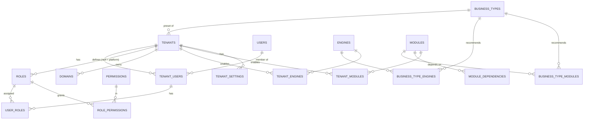

# Entity Relationship Diagram

## Current (Phase 0)

Only Laravel default tables exist (`users`, `sessions`, `password_reset_tokens`, cache, jobs). No relationships
beyond `sessions.user_id → users.id` (nullable, not a foreign key in the default migration).

## Target platform core (Phase 1 design — not implemented)

Update this diagram when the Phase 1 migrations are written, reflecting the actual columns.
