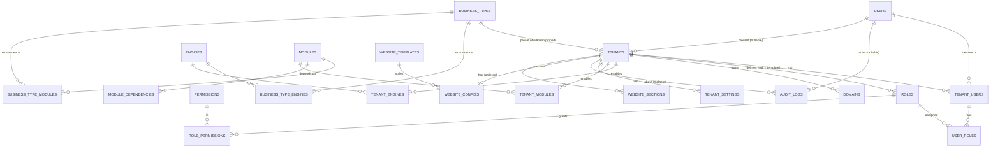

# Entity Relationship Diagram

## Platform core (Phases 1–2 — implemented)

Column details: [schema.md](schema.md).

Phase 2 added `tenants.created_by_user_id` and the website tables (ADR-012).

`USER_ROLES` carries `tenant_id` and composite FKs to both `TENANT_USERS (id, tenant_id)` and
`ROLES (id, tenant_id)`, so a membership and its roles always share a tenant (ADR-011).

Laravel default tables (`sessions`, `password_reset_tokens`, cache, jobs) are omitted.
